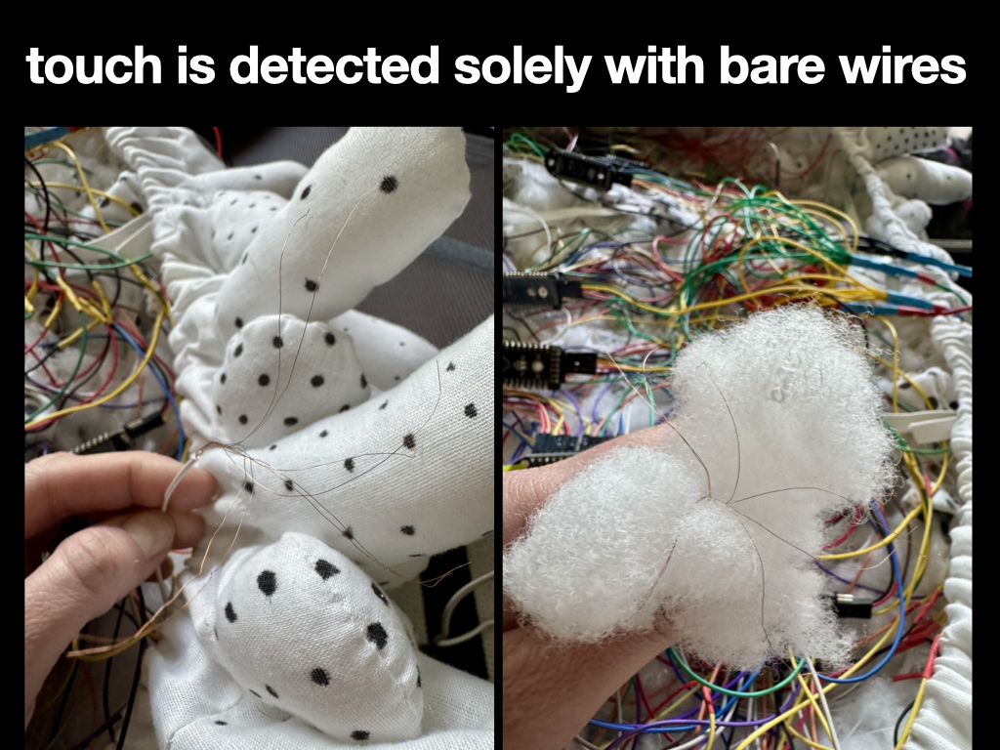

# Trill Node


Node.js app code & PureData patch for a yayoi kusama inspired touch+sound installation. Basically, it's a C++ wrapper in JS for detecting touch for many, many (236 to be exact) plushy touch points using 8 Bela trill craft conductive touch sensors.

Painstakingly constructed by hand - freehand sewn by machine, polka-dotted by hand, wire and assembled by hand.

Touches are transformed into lo-fi dreamy melodies using PureData.

Made for our home + exhibited as a sound art installation for Future Frontend Conf 2025 in Helsinki.

## Demo

https://github.com/user-attachments/assets/a44ee7c9-2a87-442c-a1f0-e459439cff83

## Project design


### Rear view of the project's construction


### Touch detection


## Installation

```bash
npm i
npm run build
```

## RUNNING

### Setup pure data patch to run on boot

- cd `/etc/xdg/labwc`
- `sudo nano autostart`
- Add line `pd -nogui /home/pi/projects/trill-node/'Ambient test.pd' &`
- `sudo reboot now`

### Setup pm2

```shell
  npm i -g pm2
  pm2 startup
  sudo env PATH=$PATH:/home/pi/.nvm/versions/node/v22.14.0/bin /home/pi/.nvm/versions/node/v22.14.0/lib/node_modules/pm2/bin/pm2 startup systemd -u pi --hp /home
  pm2 start npm --name "TRILL" -- start
  pm2 save
  pm2 logs
```

To restart: `pm2 restart TRILL`
To stop: `pm2 stop TRILL`
